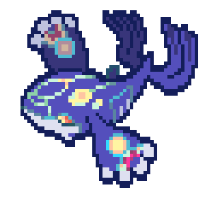

<h2 align="center" style="color:#70A5FD;">✨ Welcome to My GitHub ✨</h2>

  I’m John Carl Ola, a developer passionate about building web and desktop applications. 
  With experience in C#, Java, and UI/UX design, I focus on creating projects that are both functional and user-friendly. 
  I’m currently exploring databases, APIs, and security as I work toward developing AI-driven, production-ready applications.

  

  

  
  
  

